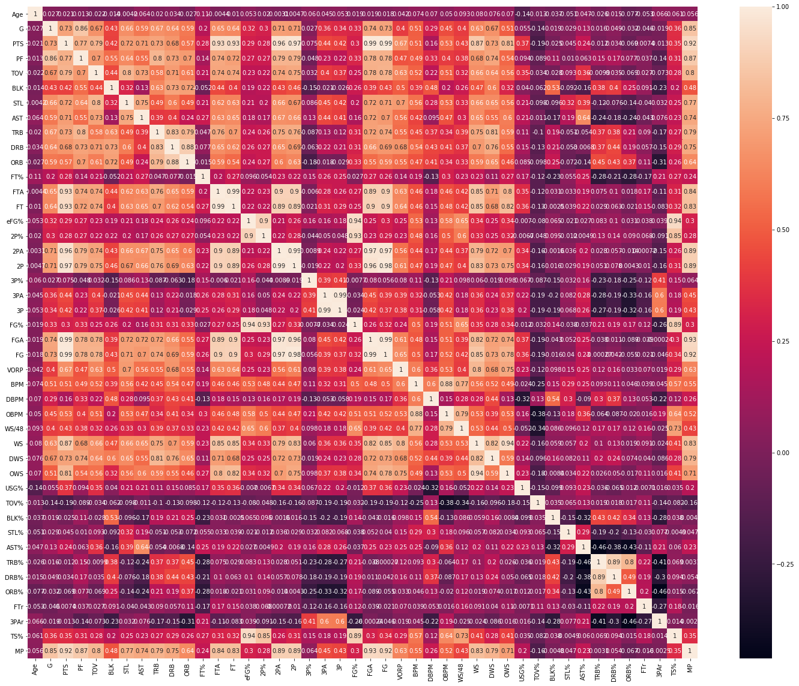
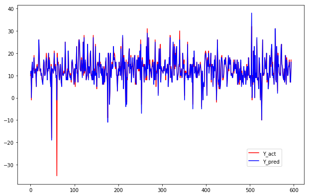
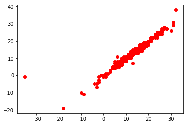

## This project is regarding the analysis over NBA data set which involves cleaning of the data and checking the correlation between the attributes of the dataset so that I can get to know whether to run PCA or not

#### This is the image of the heatmap you can see

I will be running PCA but not here.
I will be displaying the results with PCA in different program

------
#### Then started with normalizing the data and then running Linear Regression over it

Then finally predicting the results

This is the prediction of the instances of test data

This is the scatter plot displaying the Y_pred vs Y_act

Finally measuring the R2 value which is .92 which is good only to determine the goodness of fit.